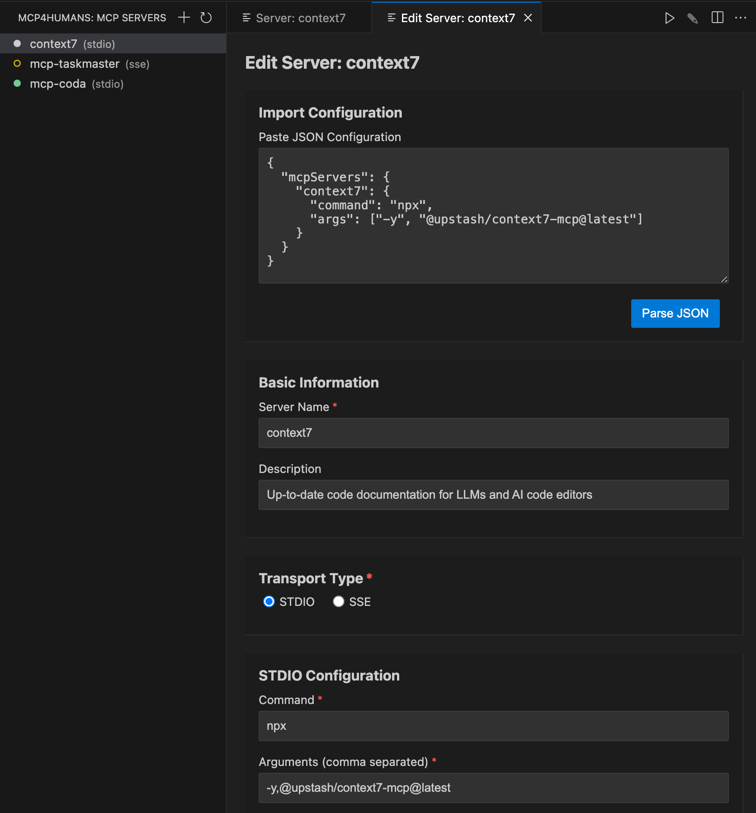
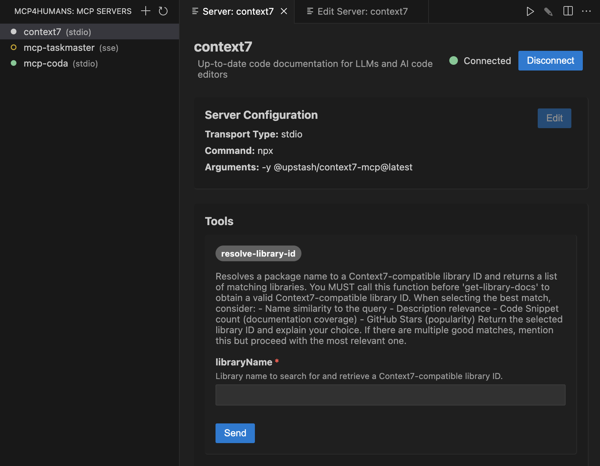

# MCP4Humans - Model Context Protocol Client for VS Code

MCP4Humans is a user-friendly VS Code extension that allows you to connect to and interact with Model Context Protocol (MCP) servers directly from your editor. It provides an intuitive interface for managing MCP servers, executing tools, and viewing results.

## What is MCP?

The Model Context Protocol (MCP) is an open standard for AI tools and agents to interact with external systems. It enables AI models to access tools, resources, and capabilities beyond their training data, such as:

- Retrieving information from databases or the web
- Executing code
- Accessing file systems
- Interacting with APIs
- And much more

## Features

### Easy Server Management

- Add, edit, and delete MCP server configurations
- Connect to both local (stdio) and remote (SSE) MCP servers
- View server connection status at a glance

### Tool Execution

- Browse available tools from connected MCP servers
- Execute tools with a simple form interface
- View tool execution results in a collapsible panel
- Work with multiple servers in parallel

### Seamless Integration

- Access MCP servers directly from the VS Code sidebar
- Persistent storage of server configurations
- Intuitive UI that follows VS Code design patterns

## Getting Started

1. Install the MCP4Humans extension from the VS Code Marketplace
2. Click the MCP4Humans icon in the activity bar to open the MCP Servers view
3. Click the "+" button to add a new MCP server
4. Fill in the server details:
   - You may start by pasting the usual JSON Claude configuration in the JSON box and letting it populate part of the form for you.
   - Fill in the rest as needed.
5. Click "Connect" to test and save the server configuration
6. Click on a server in the list to view and execute available tools

## Supported Server Types

### Local (stdio) Servers

MCP4Humans supports local MCP servers that communicate via standard input/output (stdio). You can configure:

- Command: The executable to run (e.g., `python`, `node`, `uv`)
- Arguments: Command-line arguments (e.g., `run`, `server.py`)
- Working Directory: For local installations or development.
- Environment Variables: Custom environment variables to pass to the server process.

### Remote (SSE) Servers

MCP4Humans also supports remote MCP servers that communicate via Server-Sent Events (SSE). You can configure:

- URL: The server endpoint (format: `http(s)://{host}:{port}/sse`)
- Headers: Custom HTTP headers for authentication or other purposes

## Requirements

- VS Code 1.99.0 or higher
- An MCP-compatible server to connect to

## Feedback and Contributions

- File issues and feature requests on our [GitHub repository](https://github.com/daninemonic/mcp4humans)
- Contribute to the development by submitting pull requests

## License

This extension is licensed under the MIT License. See the LICENSE file for details.

**Enjoy using MCP4Humans!**
